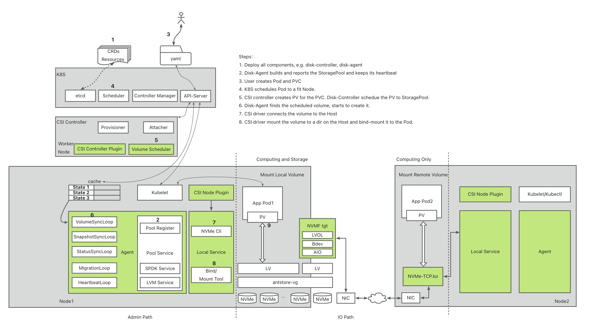

# LiteIO 

**LiteIO** is a cloud-native block device service that uses multiple storage engines, including SPDK and LVM, to achieve high performance. It is specifically designed for Kubernetes in a hyper-converged architecture, allowing for block device provisioning across the entire cluster.

## Features

1. **High Performence**: LiteIO's data engine is built on SPDK and uses NVMe-over-Fabric protocol to directly connect computing nodes to storage nodes. With efficient protocol and backend I/O polling, LiteIO provides high performance close to that of local disk.
2. **Cloud-native**: LiteIO integrates with Kubernetes through CSI controller and driver, providing a cloud-native user interface. Users can dynamically allocate or destroy LiteIO volumes using PVC.
3. **Easy Setup**: With only a few dependencies, such as Hugepages, LiteIO can be quickly set up with a single command line.
4. **Hyper-converged Architecture**: LiteIO follows a hyper-converged architecture, where a single node can function as both a frontend and backend simultaneously. There is no minimum number of nodes required to initialize a new cluster.

---

## Architecture

LiteIO consists of six main components:

1. **Disk-Agent**: The Disk-Agent is installed on each backend node and manages the StoragePool on that node. It interacts with the data engine to create and delete volumes and snapshots. Additionally, the Disk-Agent reports the status of the StoragePool to the central control and collects volume metrics, which can be exposed as a Prometheus exporter.
2. **Disk-Controller**: The Disk-Controller is aware of all the StoragePools and Volumes in the cluster. Its primary responsibility is to schedule a requested volume to a suitable StoragePool.
3. **nvmf_tgt**: nvmf_tgt is the data engine based on SPDK, which provides storage abstraction and capabilities such as LVS (Logical Volume Store), LVOL (Logical Volume), aio_bdev, NoF over TCP transport, and NoF subsystems. While nvmf_tgt is optional, it is required if applications need storage beyond local disk. LiteIO also supports Linux LVM as a data engine, which is sufficient for local storage scenarios.
4. **nvme-tcp**: nvme-tcp is a kernel module that provides TCP transport for NVMe over fabrics. It must be installed on computing nodes.
5. **CSI-Driver**: LiteIO's CSI-Driver implements K8S CSI and is deployed as a DaemonSet pod on computing nodes. It utilizes nvme-cli tools to connect to backend storage.
6. **CSI-Controller**: The CSI-Controller is a central service that handles the creation and deletion of PVs.

Overall, LiteIO's architecture provides a scalable and efficient approach to cloud-native block storage. By utilizing multiple components and interfaces, LiteIO offers a flexible and configurable solution for various storage scenarios.

## Quick Start

The Quick Start Guide helps you to seup a local K8S cluster and deploy NexusProject in it.

- [Quick Start](doc/en/quick-start.md)
- [Setup K8S by kubeadm](doc/en/kubeadm-install.md)

## Performance Benchmark

### LiteIO vs Native Disk

The Performance Results of FIO with 1 Disk of Native Disks, LiteIO NoF, and OpenEBS Mayastor: (a) IOPS (b) Bandwidth.

Unit: IOPS(K)

|                        | Native-Disk | LiteIO | Mayastor |
|------------------------|-------------|----------|----------|
| 4k-rand w-dq16 4jobs   | 356.2       | 317.0    | 218.0    |
| 4k-rand w-dq1 1jobs    | 62          | 18       | 15       |
| 4k-rand r-dq128 8jobs  | 617.0       | 614.6    | 243.8    |
| 4k-rand r-dq1 1jobs    | 11.7        | 8.5      | 7.6      |
| 128k-seq r-dq128 4jobs | 24.9        | 24.8     | 19.7     |
| 128k-seq w-dq128 4jobs | 15.6        | 15.5     | 15.4     |

Unit: Bandwidth(MB/s)

|                        | Native-Disk | LiteIO | Mayastor |
|------------------------|-------------|----------|----------|
| 4k-rand w-dq16 4jobs   | 1459.6      | 1299.2   | 896.4    |
| 4k-rand w-dq1 1jobs    | 255.6       | 76.1     | 63.1     |
| 4k-rand r-dq128 8jobs  | 2528.0      | 2516.4   | 998.0    |
| 4k-rand r-dq1 1jobs    | 47.8        | 34.6     | 31.1     |
| 128k-seq r-dq128 4jobs | 3263.0      | 3271.0   | 2585.6   |
| 128k-seq w-dq128 4jobs | 2037.6      | 2030.0   | 2021.4   |

### LiteIO vs ESSD-PL3

4K Mixed Random Read/Write (70%/30%) IOPS with 1 Job

Unit: IOPS(K)

| Queue Depth | ESSD-PL3 | LiteIO |
|-------------|----------|----------|
| 1           | 5.0      | 6.0      |
| 4           | 20.9     | 23.4     |
| 16          | 83.3     | 84.9     |
| 128         | 206.1    | 333.9    |
| 256         | 206.4    | 426.2    |

## Target Scenario

LiteIO is not a conventional distributed storage system for general purposes. It is best suited for users who require high IO performance similar to that of local disk. For example, distributed databases and AI training jobs benefit from LiteIO's ability to provide both local and remote volumes.

LiteIO is specifically designed for Kubernetes and allows users to utilize all storage on all nodes. This makes it ideal for users who need to run apps in a K8S environment.

However, it is important to note that LiteIO does not currently support data replication. If your application requires data replication, please note that it is on our roadmap for future development. In the meantime, it is recommended that your application has data replicas and can guarantee data security by itself, or that you are tolerant of data loss.

## Advanced Topics

- [Build Guide](doc/en/build.md)
- [How to Customize Plugins](doc/en/plugins.md)

## Roadmap

- [x] Disk-Agent exposes metric service
- [ ] SPDK volume replica